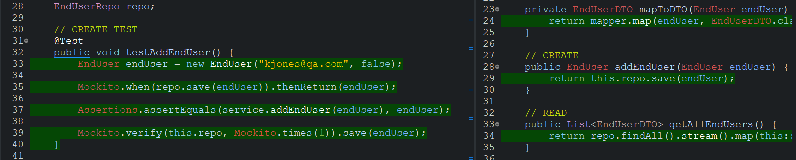
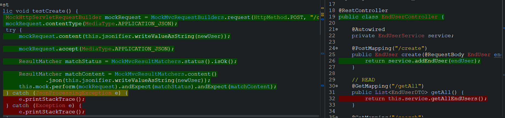

Coverage: 69.4%
# Life Goals

IMPORTANT!: THIS APP IS NOT SECURE. DO NOT USE IT TO STORE SENSITIVE INFORMATION.

This is a simple CRUD Application used to manage your life goals. It allows a user to connect to a database through a web page and create, read, update, and delete data. It has 3 types of stored data that can be managed. These are users, life goals, and tasks. A life goal belongs to a user and tasks belong to a goal. When you first open the App, it will be on the login page. There you can create a new user or log in. You can then add, remove, or edit life goals with descriptions using the buttons. Click on a life goal to create a task needed to achieve it. These can also be created, edited and deleted.

## Contents
* [Getting Started](#Getting-Started)
* [Prerequisites](#Prerequisites)
    * [Required dependencies](#Required-Dependencies)
    * [Recommended dependencies](#Recommended-Dependencies)
* [Installing](#Installing)
* [How to use the application](#How-to-use-the-application)
* [Running the tests](#Running-the-tests)
    * [unit tests](#unit-tests)
    * [integration tests](#integration-tests)
    * [And coding style tests](#And-coding-style-tests)
* [Deployment](#Deployment)
* [Built With](#Built-With)
* [Versioning](#Versioning)
* [Authors](#Authors)
* [License](#License)
* [Acknowledgments](#Acknowledgments)

## Getting Started

These instructions will get you a copy of the project up and running on your local machine for development and testing purposes. See deployment for notes on how to deploy the project on a live system.

### Prerequisites

#### Required dependencies:

In order to run the application, you need to install MySQL. It will not function without it.

Find the download here: https://dev.mysql.com/downloads/windows/installer/8.0.html
 and instructions to install MySQL here: https://dev.mysql.com/doc/mysql-installation-excerpt/5.7/en/installing.html

#### Recommended dependencies:

Although it is not necessarily required, it is recommended to install the following dependencies in order to avoid any issues with the application:

Java (17 or later): Download:https://www.oracle.com/java/technologies/downloads/#jdk18-windows
                    Install: https://www.java.com/en/download/help/download_options.html

Maven: Download: https://maven.apache.org/download.cgi
       Install: https://maven.apache.org/install.html

### Installing

Once you have installed the dependencies, you can install the application simply by downloading the file located in "target" folder in this repository, called "QaSpring-0.0.1-SNAPSHOT.jar". Store this anywhere you like in your file system.

## How to use the application

To open the app, open your command line and navigate to the folder containing the file you downloaded for the installation. Then enter the command: java -jar .\QaSpring-0.0.1-SNAPSHOT.jar
Hit 'Enter'. The application will start in your command line.

When the application is launched(You will be able to tell because your command line will say "Hi"), you will need to open your web browser(Preferably Google Chrome). It the search bar at the top, type in: 

localhost:8082/index.html

This will take you to the login page. As you will not have a username yet, you will need to create one. Enter your desired username and click "Create user". You can then click "Log in" to open the app. Trying to click log in when the credentials do not match an existing user will simply not work.

Once you have logged in, you will be greeted and it will say, Hello, (Your username). This is the READ function for the user. You have a button underneath the greeting to DELETE the user. This will take you back to the login page and the user, along with all of its goals and tasks will be deleted.

To create a new life goal, click on the button which says "Create life goal", and type in a title and description of the goal into the popup box, and click "Create".

You can view your goals by clicking on the "View goals" button.

To Edit or delete a goal, click on it. This will also show you the tasks if you have any and the create button. To create a new task, click on the "Create task" button and the process is then the same as making a new goal. Clicking on the delete buttons will delete the goal or the task it is on. Clicking edit button on a goal or task will open input boxes for you to change the title or description. Then click "UPDATE" to save the changes.

## Running the tests

In order to run the tests, you must download the entire repository and then open it in an IDE, such as Eclipse.

You can download Eclipse here: https://www.eclipse.org/downloads/

Once you open the projet in your IDE, you must select the project and check the coverage. In Eclipse, you can do this by right clicking on the project folder in the project explorer. The go down to "Coverage As" and select "Junit test". This will run all tests for the project.

### Unit Tests 

For the unit tests, I have used Junit with Mockito in order to check that the individual methods are working properly and that they reaturn the expected results. Here is an example of how the tests in this project are created:

### Integration Tests 
The integration tests are created using SPRING MVC and they are there to make sure that the controllers produce the expected results, regardless of whether or not the other parts of the application are working.

Here is an example of an integration test in this project:

## Deployment

Add additional notes about how to deploy this on a live system

## Built With

* [Maven](https://maven.apache.org/) - Dependency Management

## Versioning

We use [SemVer](http://semver.org/) for versioning.

## Authors

* **Kester Jones** - *Development* - [kesterjones](https://github.com/KesterJJ)

## License

This project is licensed under the MIT license - see the [LICENSE.md](LICENSE.md) file for details 

*For help in [Choosing a license](https://choosealicense.com/)*

## Acknowledgments

* Andrew McCall - an inspiring hero who taught me everything I needed to know about coding and life.
* Hat tip to anyone whose code was used
* Inspiration
* etc